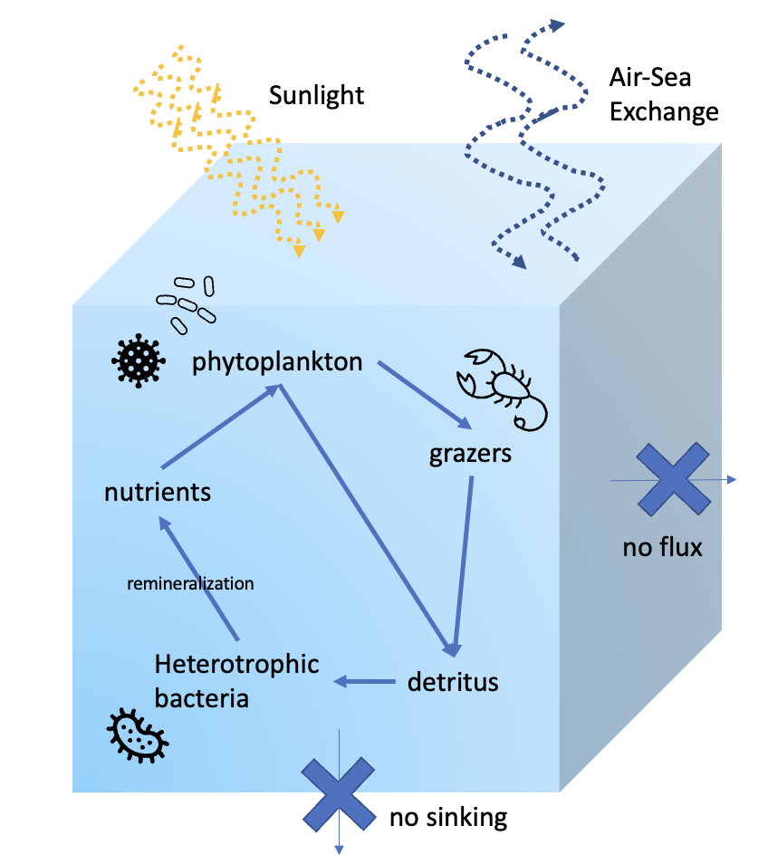

# Getting Started 

DAR1 is a tool for designing and running experiments simulating the marine microbiome within a single cube of water. The biogeochemical forcing is powered by the [MIT Darwin Model](https://darwinproject.mit.edu/), and DAR1 provides a Julia interface to build, configure, and run experiments with a simple, streamlined workflow. 



DAR1 Model Configuration: The DAR1 system models a single, well mixed parcel of water. The standard configuration consists of the DARWIN ecosystem-biogeochemical model, with free gas exchange with the atmosphere. Horizontal and other vertical fluxes are set to zero. These conditions can be modified by the user.

# Basic Structure 

DAR1 is composed of three main parts: the MITgcm Darwin code, a configuration made for DAR1, and the julia interface to modify the configuration and run the model. 

- [DAR1](https://github.com/barbara42/Dar_One) - Julia interface for organizing experiments and setting up parameters for model runs 
    - `MITgcm_path` variable needs to point to darwin3
- [darwin3](https://github.com/darwinproject/darwin3) - MITgcm source code set up to include all things Darwin 
    - `dar_one_config` - folder for the base configuration files for DAR1, which lives in the darwin3/verification/ folder. ([DAR1_config github](https://github.com/barbara42/dar_one_config))

Experiments are designed and run in a Julia file using the DAR1 Julia interface. This will create a unique run folder nested underneath the MITgcm darwin code and the dar_one_config folder. You will never have to look at the fortran of MITgcm Darwin or at the configuration files! However, output of the experiment is saved underneath that unique run folder that is created in `darwin3/verification/dar_one_config/run`.


# Installation 

DAR1 can be run in one of two ways. 
1) In a **docker container** using the DAR1_docker image, where all dependencies are handled for you 
2) On your local machine, where you have to set up the environment, download dependencies, etc 
    - this is more time consuming, and I strongly recommend using the docker image
    - instructions for local setup are below

## Setting up with docker

(1) Download and install [docker desktop](https://www.docker.com/).
- Run the docker application, which will start up the docker "daemon" 
- The docker daemon must be running in order to download the DAR1 image and to start up a container

(2) Get the [DAR1_docker image](https://hub.docker.com/repository/docker/birdy1123/dar1).
- using the command line, run 

    `docker pull birdy1123/dar1`

- If you go to the "Images" tab in the docker desktop UI, you should see "birdy1123/DAR1_docker"

(3) Run a container based on the DAR1_docker image
- using the command line, run 

    `docker run -it birdy1123/dar1` 
- this runs the container in interactive mode (`-i`) with terminal access (`-t`) 
- you should see the prompt change to `root@some-number:/dar_one_docker#`
- once the container is running, you can also connect to a new bash terminal inside the container using the command `docker exec -it container_id /bin/bash`. The container id can be found in the Docker desktop app or the "some-number" that appears in the previous bullet point. 

You're now ready for the [beginner tutorial](https://barbara42.github.io/Dar_One/build/beginner_tutorials/)!


## Setting up on local machine

You will need to clone 3 git repositories
- DAR1
- darwin3 
- dar_one_config

First, we will clone the DAR1 code. 

```
git clone https://github.com/barbara42/Dar_One.git
```

Then in a directory of your choosing, clone the MITgcm Darwin code. I put this in a folder called "climate_models" on my desktop.

```
git clone https://github.com/darwinproject/darwin3.git
```

Once darwin3 code is cloned, we will navigate to the `/verification` folder underneath it. 

```
cd darwin3/verification
```
Here, under `darwin3/verification`, we will clone the `dar_one_config` repository. 

```
git clone https://github.com/barbara42/dar_one_config.git
```

After these steps, you should have 
1. the DAR1 source code 
2. the darwin3 source code
3. the `dar_one_config` code nested under `darwin3/verification`

### Dependencies 

In order to build and run the MITgcm on your machine, you need to have the following installed as well
- gfortran
- netcdf 


For the Julia code, you will need to install julia and the following packages 
- OrderedCollections
- Suppressor
- ClimateModels
- NCDatasets

The Julia dependencies are also listed in the file at the top level of `Dar_One/packages.jl`. You can automatically install the Julia dependencies by running `julia packages.jl`.

If you get errors when building the model, see the [MITgcm getting started guide](https://mitgcm.readthedocs.io/en/latest/getting_started/getting_started.html#) to help troubleshoot.  

You can also see the dockerfile used [here]()

```
FROM --platform=linux/amd64 ubuntu:latest 
WORKDIR /dar_one_docker
COPY . . 

RUN apt-get update -y
RUN apt-get install wget -y
RUN apt-get install vim -y

# download, install, and link julia 
RUN wget https://julialang-s3.julialang.org/bin/linux/x64/1.8/julia-1.8.2-linux-x86_64.tar.gz
RUN tar zxvf julia-1.8.2-linux-x86_64.tar.gz
ENV PATH="${PATH}:/dar_one_docker/julia-1.8.2/bin"
# install julia packages 
RUN julia packages.jl

# other dependencies 
RUN apt-get install -y gfortran make 
RUN apt-get install -y python-is-python3
# future: try netcdf-bin instead? does it still work? 
RUN apt-get install -y libnetcdff-dev 
```

# Workflow

For more in-depth instructions, check out the [beginner tutorials](https://barbara42.github.io/Dar_One/build/beginner_tutorials/)

In general, experiments with DAR1 are divided into two main steps 
1. Building
    - grid size
    - nutrient cycling
2. Running
    - set up experiment config
    - initialize parameters

I like to separate these out into two scripts because the build step only has to be done once for each experiment setup. After you settle on what grid size to use (classically 1x1) and what nutrient setup (classically freely cycling, can also be set to constant available nutrients), you can modify all other parameters without having to re-build. 

I recommend creating a folder at the top level of the `Dar_One` directory with the name `your-name-experiments`, and putting all scripts you create in there. 

For every DAR1 script, you will first import DarOneTools. 
```
include("../src/DarOneTools.jl")
using .DarOneTools
```

Next you must always make sure you have a line specifying the correct value for `MITgcm_path[1]`. If you are using the docker, it will be set to "/dar_one_docker/darwin3". Otherwise, you will point it to the direcotry of [darwin3](https://github.com/darwinproject/darwin3) on your local machine. 

```
# the path to the Darwin version of the MITgcm
MITgcm_path[1] = "/dar_one_docker/darwin3" 
```

You build with the following function.

```
build(base_configuration)
```
Once the model has been built, you can run multiple experiments with different values for the intial parameters. I like to put the previous code in one file, and the code to initialize and run an experiment in another.

For the run script, you will also have to import DarOneTools and set the MITgcm path. 

```
include("../src/DarOneTools.jl")
using .DarOneTools

# the path to the Darwin version of the MITgcm
MITgcm_path[1] = "/dar_one_docker/darwin3" 
```

Set up experiment config id 

```
config_id = "unique-experiment-name" # CHANGE ME
config_obj, rundir = create_MITgcm_config(config_id)
setup(config_obj)
```

The next step is to modify parameters (in-depth descriptions in [beginnger tutorial](https://barbara42.github.io/Dar_One/build/beginner_tutorials/)). For modifying parameters, you will need to pass the `config_obj` to each update function. 

Then run the model. 

```
run(config_obj)
```

To recap the basic workflow: 
- Always import `DarOneTools` and set `MITgcm_path`
- Build
    - set your grid size
    - set nutrients to cycle or stay constant 
    - build
- Run
    - setup experiment config
    - modify parameters 
    - run